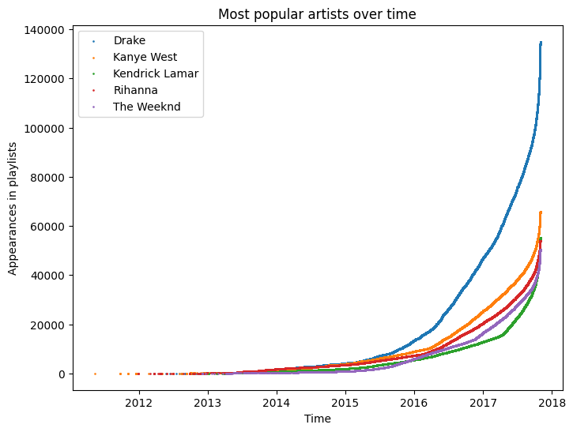
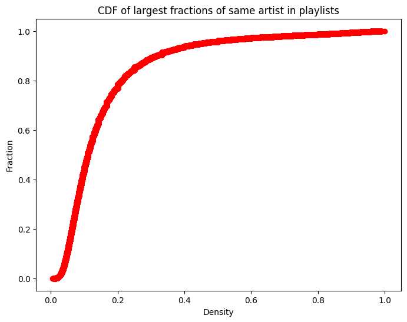

# Project 1: Big Data Programming Paradigms

## Note

You might need to do this to let IDE correctly find Spark.

```shell
export SPARK_HOME=/home/hadoop/spark
export PYTHONPATH=$SPARK_HOME/python/:$PYTHONPATH
```

## Datasets

The project involves working with two datasets:
- tracks
- playlist

## Tasks

### 1. Statistics about songs duration

For this task, I utilized the Interquartile Range Rule ([IQRR](https://www.thoughtco.com/what-is-the-interquartile-range-rule-3126244)), a technique that removes points outside an interval defined by the 1st and 3rd quartiles. I employed the PySpark DataFrame APIs to perform the necessary calculations, utilizing the built-in function approxQuantile for computing percentiles.

(1) Minimum, average, and maximum song durations, in milliseconds, of the songs in the dataset:

| min_duration | avg_duration     | max_duration |
|--------------|------------------|--------------|
| 0            | 234408.54976216817 | 10435467     |

(2) First quartile, third quartile, and interquartile range (IQR) of the song durations:

|first_quartile|third_quartile|interquartile_range_duration|
|--------------|--------------|----------------------------|
|      198333.0|      258834.0|                     60501.0|

(3) By applying the IQRR methodology, a total of 559,989 songs were identified as outliers and subsequently removed from the analysis.

(4) Minimum, average, and maximum song durations, in milliseconds, of the remaining songs after removing the outliers:

| min_duration | avg_duration       | max_duration |
|--------------|--------------------|--------------|
| 107582       | 226899.35353939075 | 349583       |

After identifying and removing the outliers, the 559,989 songs found to be outliers account for only 5.20% of the total songs in the dataset. However, their removal had a significant impact on the average song duration, resulting in a 3.20% reduction. This suggests that the presence of some extremely long songs was biasing the average towards higher values.

Before removing the outliers, the minimum duration recorded was 0 milliseconds, which is not a valid value for a song duration. However, after excluding the outliers, the minimum duration became 107,582 milliseconds, which is approximately 108 seconds or about 1 minute and 48 seconds. This minimum duration seems more reasonable for a valid song.

On the other hand, before removing the outliers, the maximum duration observed was 10,435,467 milliseconds, which is almost 3 hours. However, after removing the outliers, the maximum duration reduced to 349,583 milliseconds, which is approximately 5.8 minutes. This significant reduction in the maximum duration indicates that the dataset contains songs with a wide range of durations, occupying most of the interval defined by the interquartile range rule (IQRR).

### 2. Finding the most popular artists over time

The five most popular artists, ranked by the number of playlists they appear in, are as follows:

|   artist_name   | playlist_count |
|-----------------|----------------|
| Drake           | 32259          |
| Rihanna         | 23963          |
| Kanye West      | 22464          |
| The Weeknd      | 20046          |
| Kendrick Lamar  | 19159          |

Number of playlists containing each of the top five artists over the years:

The chart below illustrates the number of playlists containing each of the top five artists over the years:




To obtain this information, I performed a join operation between the playlist and tracks tables. This allowed me to access each song and determine the creation time of playlists. I then grouped the tables by pid and counted the distinct pid values to identify the top five artists. Subsequently, I filtered the data to include only these five artists and obtained a list of modified timestamps (`modified_at`) for the playlists. 

All five popular artists experienced exponential growth in terms of the number of playlists they appeared in over the years. Their popularity exhibited similar patterns, indicating a consistent year-over-year growth rate.

### 3. Playlists's behavior

The cumulative distribution function (CDF) of artists' prevalences across all playlists is shown in the chart below:



To generate this result, I first counted the number of songs in each playlist. Next, I applied a window function to partition the tracks table by pid and obtained the highest occurring artist song count within each window. By dividing the count of songs by the count of the highest occurring artist, I determined the largest fraction of the same artist in each playlist.

The results indicate that approximately 80% of the playlists have a largest fraction of the same artist density around 0.2. This suggests that most playlists contain diverse songs and are not limited to songs by a single favorite artist.